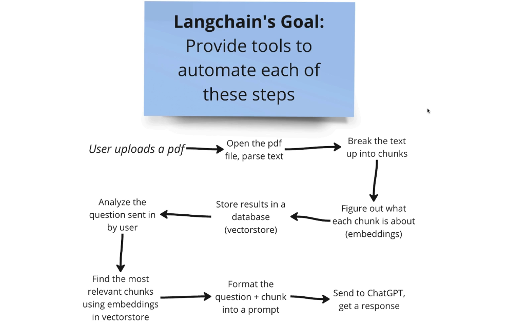

# Module 1 - Introduction to LangChain

LangChain Documentation

https://docs.langchain.com/oss/python/langchain/overview

## What is LangChain?

LangChain is a powerful framework designed to simplify the development of applications that leverage large language models (LLMs). It provides tools and abstractions to help developers build applications that can interact with LLMs in a more structured and efficient way.

